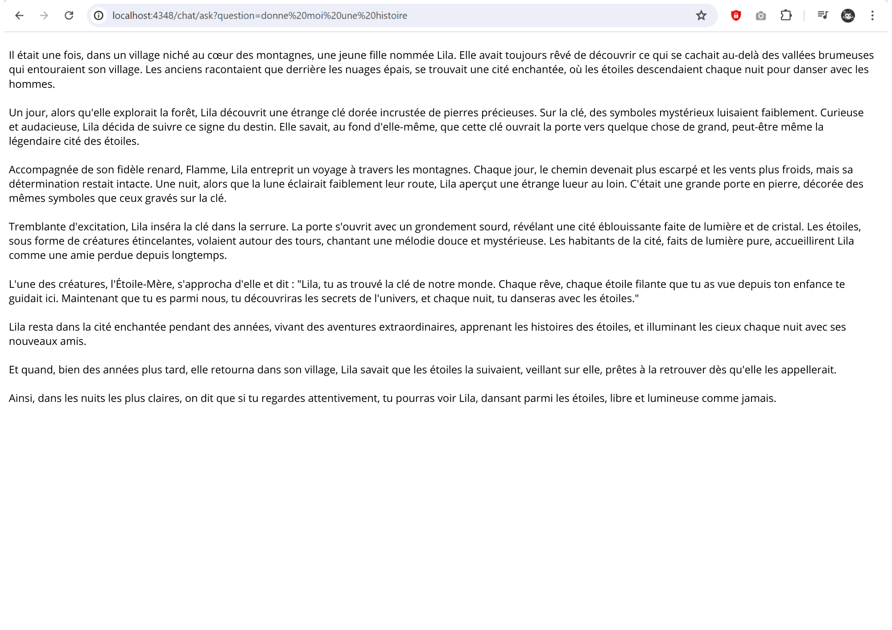
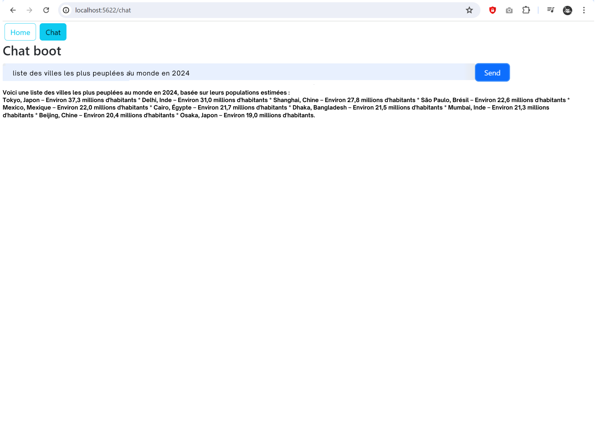
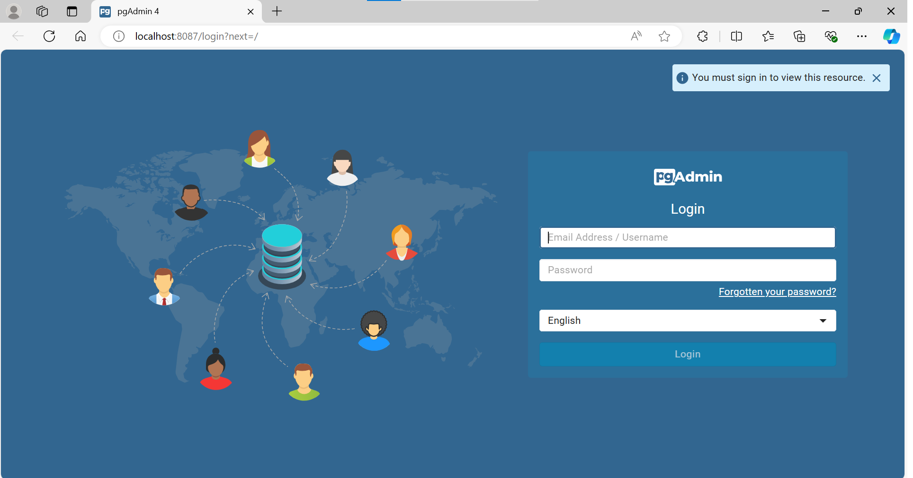
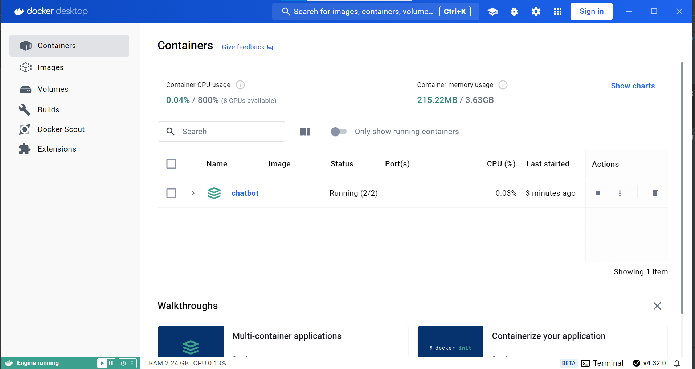

# Développement d'un Chat Bot RAG Spring React
Ce projet consiste à développer une application web fullstack qui intègre Spring pour la partie backend et React associé à VAADIN pour le frontend. L'objectif est de concevoir un chatbot basé sur une approche de génération augmentée par la récupération d'informations (RAG), en utilisant les modèles de langage Llama3 et OpenAI. Le backend repose sur Spring AI, tandis que l'interface utilisateur, réalisée avec React et VAADIN, est conçue pour offrir une expérience fluide et interactive.sur Spring AI, tandis que l'interface utilisateur est construite avec React et VAADIN pour une expérience fluide et interactive.

